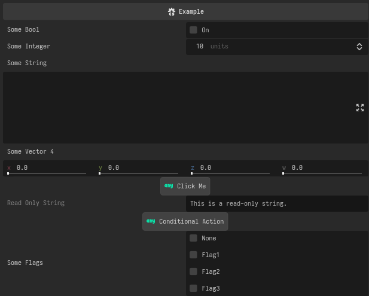

# Export Forge

 
<p align="center">
    
</p>

Package designed to make advanced Godot exported properties easy. 
Build property list for any `GodotObject` with intuitive API.

## Installation

You can download add-on through Godot AssetLib normally. Recommended way of installing is
with [GodotEnv](https://github.com/chickensoft-games/GodotEnv) by adding the following to your project's `addons.jsonc`:

```json
{
    "addons": {
        // ... other addons ...

        "export-forge": {
            "url": "https://github.com/maxusify/export-forge",
            "subfolder": "addons/export-forge"
        }
    }
}
```

```bash
# In the directory of your project where `addons.jsonc` resides.
godotenv addons install
```

## Usage

Simply create `EditorExportForge` instance for your `GodotObject`.

```csharp
namespace MyProject
{
    using Godot;
    using Godot.Collections;

    using SabishiDev.ExportForge;

    [Tool]
    public partial class Example : Node
    {
        public int SomeInt { get; set; }
        public string SomeString { get; set; } = string.Empty;
        public Vector4 SomeVector4 { get; set; }
        public bool SomeBool { get; set; } = true;
        public FlagsExample SomeFlags { get; set; }

        public readonly string SomeReadOnlyString = "This is a read-only string.";

        private readonly EditorExportForge _forge;

        public Example()
        {
            _forge = new EditorExportForge(this);

            _forge
                .CreateProperty<bool>("Some Bool")
                .OnGet(() => SomeBool)
                .OnSet(value => SomeBool = value);

            // Create a property for the integer variable.
            _forge
                .CreateProperty<int>("Some Integer")
                .OnGet(() => SomeInt)
                .OnSet(value => SomeInt = value)
                .Range(0, 100, 5, orGreater: true, suffix: " units");

            // Create a property for the string variable.
            _forge
                .CreateProperty<string>("Some String")
                .OnGet(() => SomeString)
                .OnSet(value => SomeString = value)
                .Multiline();

            // Create a property for the vector variables.
            _forge
                .CreateProperty<Vector4>("Some Vector4")
                .OnGet(() => SomeVector4)
                .OnSet(value => SomeVector4 = value)
                .Range(0, 100, 2);

            // Create a tool button from callable property.
            _forge
                .CreateProperty<Callable>("Say Hello Button")
                .OnGet(() => Callable.From(SayHello))
                .ToolButton("Click Me", icon: "Variant");

            // Create a read-only string property.
            _forge
                .CreateProperty<string>("Read Only String")
                .OnGet(() => SomeReadOnlyString)
                .ReadOnly();

            // Create a property that is shown only when a certain condition is true.
            _forge
                .CreateProperty<Callable>("Conditional Action Button")
                .When(() => SomeInt == 10)
                .OnGet(() => Callable.From(ConditionalAction))
                .ToolButton("Conditional Action", icon: "Variant");

            // Create a flags property.
            _forge
                .CreateProperty<int>("Some Flags")
                .OnGet(() => (int)SomeFlags)
                .OnSet(value => SomeFlags = (FlagsExample)value)
                .Flags<FlagsExample>();
        }

        public override Array<Dictionary> _GetPropertyList()
        {
            return _forge.ForgeProperties();
        }

        public override bool _Set(StringName property, Variant value)
        {
            return _forge.HandleSetter(property, value);
        }

        public override Variant _Get(StringName property)
        {
            return _forge.HandleGetter(property);
        }

        private void SayHello()
        {
            GD.Print("Hello from Example!");
        }

        private void ConditionalAction()
        {
            GD.Print("Conditional Action.");
        }
    }
}
```

Result:

<p align="center">
    
</p>

## Documentation

`EditorExportForge` available methods:

```csharp
/// <summary>
/// Creates a new property with the specified name. The property is of type <typeparamref name="TVariant"/>.
/// </summary>
/// <typeparam name="TVariant">Type of property. Must be a variant type. </typeparam>
/// <param name="name">Name of the property. </param>
/// <returns>Editor property.</returns>
IEditorExportProperty<TVariant> CreateProperty<[MustBeVariant] TVariant>(string name);
/// <summary>
/// Returns property list in format accepted by <see cref="GodotObject._GetPropertyList"/> method.
/// </summary>
/// <returns>Godot array of dictionaries.</returns>
GDC.Array<GDC.Dictionary> HandleGetPropertyList();
/// <summary>
/// Alias for <see cref="HandleGetPropertyList"/>.
/// Returns property list in format accepted by <see cref="GodotObject._GetPropertyList"/> method.
/// </summary>
/// <returns>Godot array of dictionaries.</returns>
GDC.Array<GDC.Dictionary> ForgeProperties();
/// <summary>
/// Handles getter for the property with specified name.
/// Should be called as return value of <see cref="GodotObject._Get"/> method.
/// </summary>
/// <param name="name">Name of the property. </param>
/// <returns>Value of the property.</returns>
Variant HandleGetter(string name);
/// <summary>
/// Handles setter for the property with specified name.
/// Should be called as return value of <see cref="GodotObject._Set"/> method.
/// </summary>
/// <param name="name">Name of the property.</param>
/// <param name="value">Value to set.</param>
/// <returns>Result of the setter operation.</returns>
bool HandleSetter(string name, Variant value);
```

`EditorExportProperty` available methods:

```csharp
/// <summary>
/// Builds the property data dictionary for use with <see cref="GodotObject._GetPropertyList()"/>.
/// </summary>
/// <returns></returns>
GDC.Dictionary BuildPropertyData();
/// <summary>
/// Returns the current value of the property as a <see cref="Variant"/>.
/// </summary>
Variant GetValue();
/// <summary>
/// Sets the value of the property from a <see cref="Variant"/>.
/// </summary>
/// <param name="value">Value to set.</param>
/// <returns>True if successful, false otherwise.</returns>
bool SetValue(Variant value);
```

Additional methods are available in `addons/export_forge/extensions` directory. 

Keep in mind that for whatever reason Godot will use only last of the applied extensions for a property that adds `PropertyHint`
to the property. For example: `.Range(...).Link()` -> Only `Link()` will be applied.
