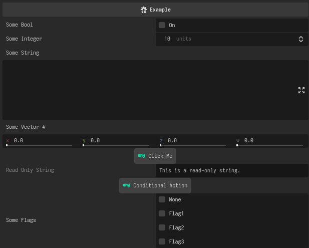

# Export Forge

 
<p align="center">
    
</p>

Package designed to make advanced Godot exported properties easy. 
Build property list for any `GodotObject` with intuitive API.

## Installation

You can download add-on through Godot AssetLib normally. Recommended way of installing is
with [GodotEnv](https://github.com/chickensoft-games/GodotEnv) by adding the following to your project's `addons.jsonc`:

```json
{
    "addons": {
        // ... other addons ...

        "export_forge": {
            "url": "https://github.com/maxusify/export-forge",
            "subfolder": "addons/export_forge"
        }
    }
}
```

```bash
# In the directory of your project where `addons.jsonc` resides.
godotenv addons install
```

## Usage

Simply create `EditorExportForge` instance for your `GodotObject`.

```csharp
namespace MyProject
{
    using Godot;
    using Godot.Collections;

    using SabishiDev.ExportForge;

    [Tool]
    public partial class Example : Node
    {
        public int SomeInt { get; set; }
        public string SomeString { get; set; } = string.Empty;
        public Vector4 SomeVector4 { get; set; }
        public bool SomeBool { get; set; } = true;
        public FlagsExample SomeFlags { get; set; }

        public readonly string SomeReadOnlyString = "This is a read-only string.";

        private readonly EditorExportForge _forge;

        public Example()
        {
            _forge = new EditorExportForge(this);

            _forge
                .CreateProperty<bool>("Some Bool")
                .OnGet(() => SomeBool)
                .OnSet(value => SomeBool = value);

            // Create a property for the integer variable.
            _forge
                .CreateProperty<int>("Some Integer")
                .OnGet(() => SomeInt)
                .OnSet(value => SomeInt = value)
                .Range(0, 100, 5, orGreater: true, suffix: " units");

            // Create a property for the string variable.
            _forge
                .CreateProperty<string>("Some String")
                .OnGet(() => SomeString)
                .OnSet(value => SomeString = value)
                .Multiline();

            // Create a property for the vector variables.
            _forge
                .CreateProperty<Vector4>("Some Vector4")
                .OnGet(() => SomeVector4)
                .OnSet(value => SomeVector4 = value)
                .Range(0, 100, 2);

            // Create a tool button from callable property.
            _forge
                .CreateProperty<Callable>("Say Hello Button")
                .OnGet(() => Callable.From(SayHello))
                .ToolButton("Click Me", icon: "Variant");

            // Create a read-only string property.
            _forge
                .CreateProperty<string>("Read Only String")
                .OnGet(() => SomeReadOnlyString)
                .ReadOnly();

            // Create a property that is shown only when a certain condition is true.
            _forge
                .CreateProperty<Callable>("Conditional Action Button")
                .When(() => SomeInt == 10)
                .OnGet(() => Callable.From(ConditionalAction))
                .ToolButton("Conditional Action", icon: "Variant");

            // Create a flags property. Enum hints are added automatically.
            _forge
                .CreateProperty<FlagsExample>("Some Flags")
                .OnGet(() => SomeFlags)
                .OnSet(value => SomeFlags = value);
        }

        public override Array<Dictionary> _GetPropertyList()
        {
            return _forge.ForgeProperties();
        }

        public override bool _Set(StringName property, Variant value)
        {
            return _forge.HandleSetter(property, value);
        }

        public override Variant _Get(StringName property)
        {
            return _forge.HandleGetter(property);
        }

        private void SayHello()
        {
            GD.Print("Hello from Example!");
        }

        private void ConditionalAction()
        {
            GD.Print("Conditional Action.");
        }
    }
}
```

Result:

<p align="center">
    
</p>

`FlagsExample` used above:

```csharp
[Flags]
public enum FlagsExample : uint
{
    None = 0,
    Flag1 = 1 << 0,
    Flag2 = 1 << 1,
    Flag3 = 1 << 2
}
```

## Documentation

### `EditorExportForge`

```csharp
// Object whose properties are provided by this forge.
GodotObject Target { get; }

// Creates a new property of type TVariant. Throws if a property with the same name already exists.
EditorExportProperty<TVariant> CreateProperty<[MustBeVariant] TVariant>(string name);

// Returns property list in format accepted by GodotObject._GetPropertyList().
GDC.Array<GDC.Dictionary> HandleGetPropertyList();

// Alias for HandleGetPropertyList().
GDC.Array<GDC.Dictionary> ForgeProperties();

// Handles getter for the property with specified name. Return it from GodotObject._Get().
Variant HandleGetter(StringName name);

// Handles setter for the property with specified name. Return it from GodotObject._Set().
bool HandleSetter(StringName name, Variant value);
```

### `EditorExportProperty<TVariant>`

```csharp
// Callback returning the current value.
EditorExportProperty<TVariant> OnGet(Func<TVariant> getter);

// Callback setting the value. By default, the editor is notified (debounced) so conditional properties refresh.
EditorExportProperty<TVariant> OnSet(
    Action<TVariant> setter,
    bool notifyWhenUpdated = true,
    bool debounceNotifyWhenUpdated = true,
    int debounceNotifyWhenUpdatedMilliseconds = 250
);

// Shows the property only when the condition is true.
EditorExportProperty<TVariant> When(Func<bool> checkCondition);

// Usage flag helpers.
EditorExportProperty<TVariant> ReadOnly();   // Adds PropertyUsageFlags.ReadOnly.
EditorExportProperty<TVariant> Store();      // Adds PropertyUsageFlags.Storage.
EditorExportProperty<TVariant> Internal();   // Removes PropertyUsageFlags.Editor.
EditorExportProperty<TVariant> SetUsageFlags(PropertyUsageFlags usageFlags);
EditorExportProperty<TVariant> AddUsageFlags(PropertyUsageFlags usageFlags);
EditorExportProperty<TVariant> RemoveUsageFlags(PropertyUsageFlags usageFlag);

// Sets the property hint. Ends the method chain (see below).
void SetPropertyHint(PropertyHint hint, string? hintString = null);
```

### Property hints

A property can only have a single `PropertyHint`, so every method that sets one ends the method chain.
Call other methods first and the hint method last:

```csharp
_forge
    .CreateProperty<float>("Speed")
    .OnGet(() => Speed)
    .OnSet(value => Speed = value)
    .Range(0, 10, 0.1f, suffix: "m/s");   // Nothing can be chained after this.
```

Hint methods are extension methods defined in `addons/export_forge/EditorExportProperty*Extensions.cs`:

| Property type | Methods |
|---|---|
| `int`, `long` | `Range`, `Flags<TFlags>`, `AsEnum` |
| `float`, `double` | `Range` |
| `Vector2`, `Vector3`, `Vector4` and their integer variants | `Range`, `Link` |
| `string` | `Multiline`, `Password`, `Placeholder`, `AsEnum` |
| `Color` | `NoAlpha` |
| `Callable` | `ToolButton` |
| `GDC.Array` | `ArrayType` |
| `GDC.Dictionary` | `DictionaryType` |

Some types get a hint automatically when the property is created. It can be replaced with `SetPropertyHint` or an extension method:

| Property type | Automatic hint |
|---|---|
| Enum | `Enum` with enum names and values, or `Flags` for `[Flags]` enums |
| `Resource` / `Node` derived | `ResourceType` / `NodeType` with the class name |
| `GDC.Array<T>`, arrays of Godot objects, `StringName[]`, `NodePath[]`, `Rid[]` | `ArrayType` with the element type |
| `GDC.Dictionary<TKey, TValue>` | `DictionaryType` with the key and value types |
